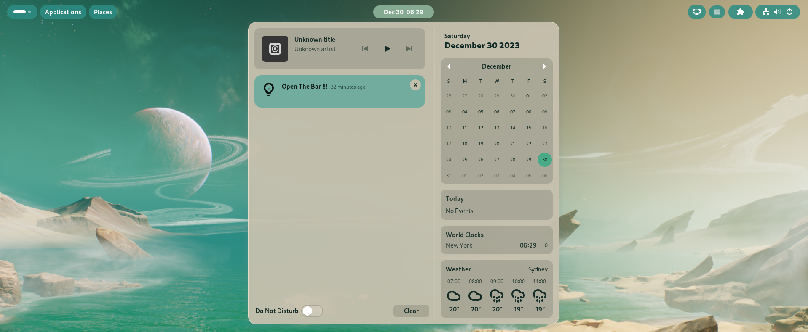
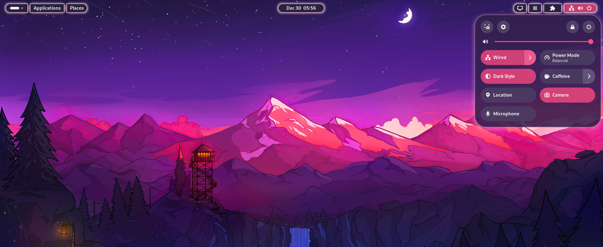
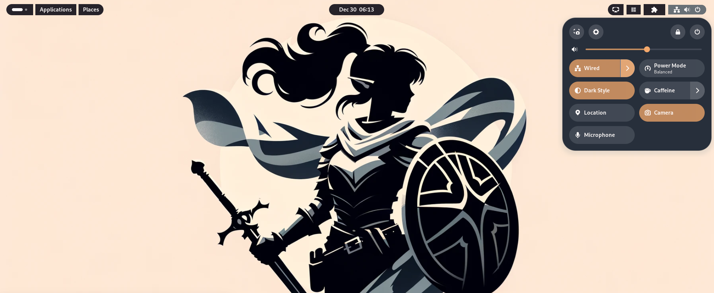
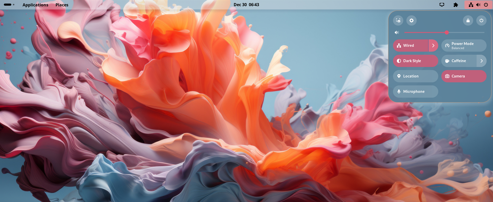
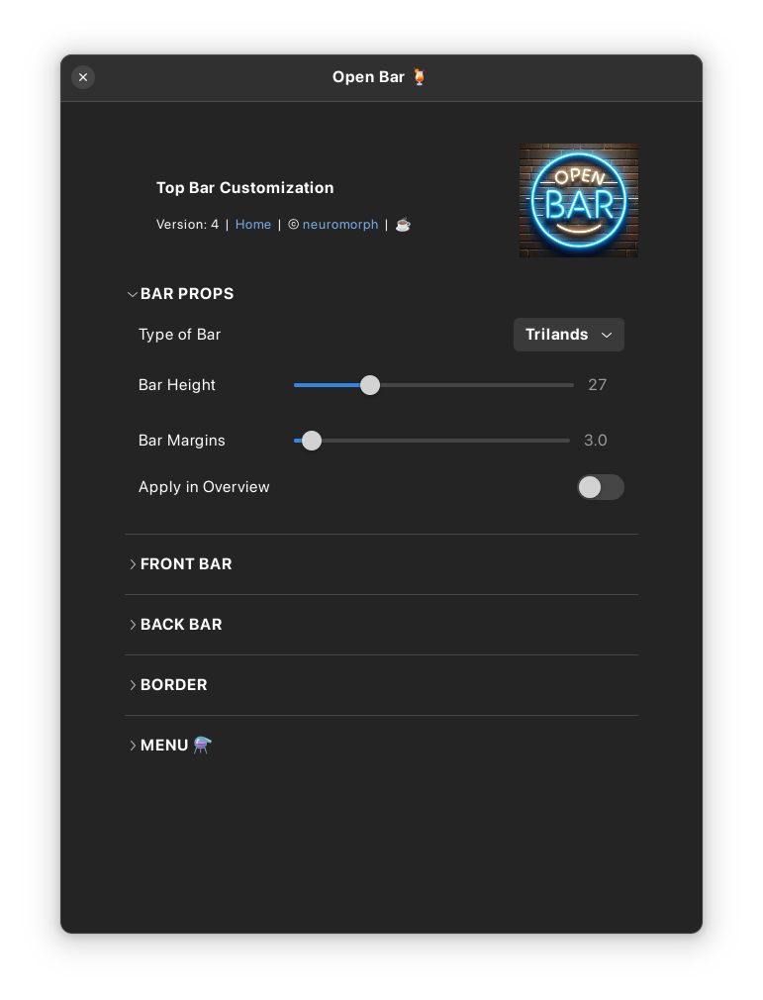
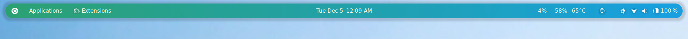
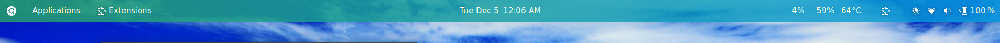
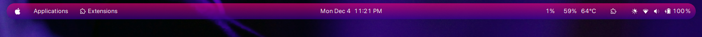
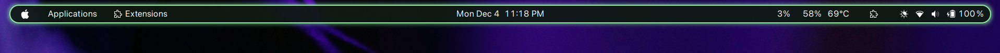

# Open Bar (GNOME 4X Extension)  


A GNOME Shell extension for customizing Gnome Top Bar / Panel.  


## Installation

### Recommended

[](https://extensions.gnome.org/extension/6580/open-bar/)

It's recommended to install the extension from
[extensions website](https://extensions.gnome.org/extension/6580/open-bar/), or from
the _Extension Manager_ app.


### How to manually install the extension (if needed)?

```
git clone https://github.com/neuromorph/openbar.git \
	~/.local/share/gnome-shell/extensions/openbar@neuromorph
```
OR download the release zip file (may not be latest) and unzip at location: ~/.local/share/gnome-shell/extensions/

You may need to restart the gnome shell environnment (for manual install):

- logout and login again (Do this if using Wayland) _or_
- `alt+f2` then type `r` and `enter` 

## Settings
Use the settings panel of the extension for customizations:
- Bar Type: Fixed, Floating or Islands
- Bar height, margin
- Bar foreground color, font
- Bar background color, transparency, gradient,  shadow
- Shape rectangular to pill, border width, color, neon glow
- Menu customizations: foreground, background colors, transparency, border, shadow,  active/selection, hover colors
etc.

If the panel/menu isn't looking right, you need to tweak some settings. There are a lot of knobs to allow for differnt setups/tastes. It can also make it a bit overwhelming if you are not familiar with css styles but with some experimentation it will become a lot easier. Here are brief notes:
- BG/FG color: Background or Foreground colors. Foreground is typically text and icons.
- Alpha: Transparency for the color. 0 is transparent while 1 is opaque.
- Panel BG will affect the bar while Islands BG will affect the individual indicator buttons/combos (in Islands mode).
- Gradient goes from Start color to End color. If you want a single color fading, select same color for both with differnt Alphas. e.g. Setting end color alpha to 0 will form a gradient from Start color to transparent.
- Highlight color: It is the background color upon hover or focus. 
- Panel Shadow: a downward shadow for the panel bar. Shadow Spread controls both shadow trasparency and spread together.
- Border: 
	- Width controls thickness that grows inwards. Adjust bar height accordingly, after setting border width.  
    - Radius will control the shape from rectangle at radius 0 to Pill at radius close to bar height. 
    - Neon glow: adds a neon-light like glow to the border. You need dark, relatively opaque background with bright/neon colored, relatively opaque border. Neon will override Panel shadow in Mainland and Floating mode.
 - Menus: 
    - FG/BG, border, highlight are similar to above but for menus.
    - Selected/active color is for menu items that are active e.g. Today's day in Calendar or WiFi in Quick Settings or even an active menu item with a submenu. 
    - Shadow applies to the panel menu. Use white/bright color in dark theme and black/dark color in light theme for the effect to show and help with contrast. Using same color as menu border is also a good idea. Use the Alphas for both border and shadow to increase or reduce their effect.
    - Lastly, menu settings do not apply as soon as changed. You need to press 'Apply Menu Styles' button to apply the changes. 'Remove Menu Styles' button will remove all menu styles and revert to your default theme.


## What's New (recent first)
- New Bar Type 'Trilands' and compatibility with 'Quick Settings Audio Panel' extension
- New overhauled version with support for menus including Calendar, Notifications, Quick Settings etc.
- Initial version created


## Screenshots





  
 





