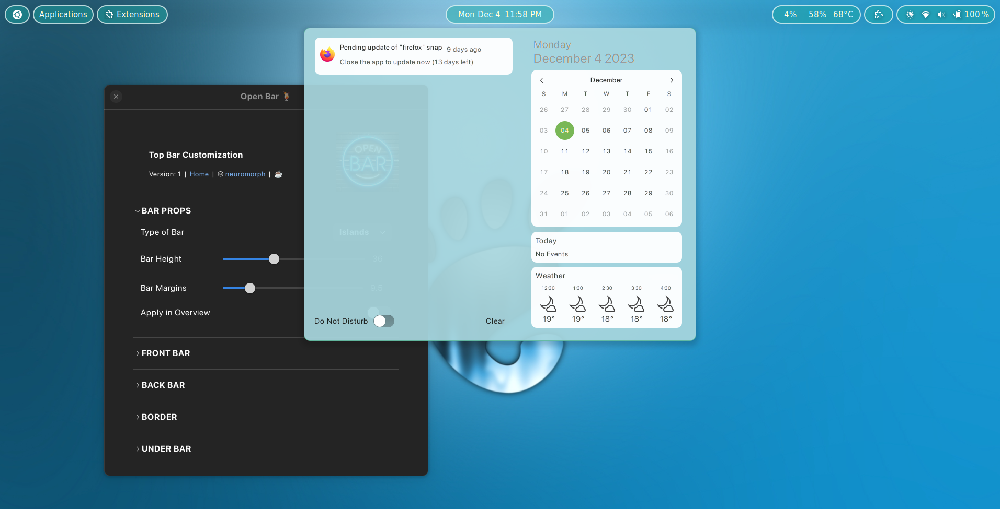
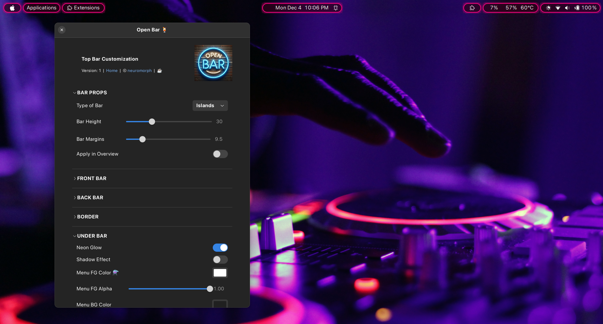

# Open Bar (GNOME 4X Extension)  


A GNOME Shell extension for customizing Gnome Top Bar / Panel.  


## Installation

### Recommended

[](https://extensions.gnome.org/extension/6580/open-bar/)

It's recommended to install the extension from
[extensions website](https://extensions.gnome.org/extension/6580/open-bar/), or from
the _Extension Manager_ app.


### How to manually install the extension (if needed)?

```
git clone https://github.com/neuromorph/openbar.git \
	~/.local/share/gnome-shell/extensions/openbar@neuromorph
```
OR download the release zip file (may not be latest) and unzip at location: ~/.local/share/gnome-shell/extensions/

You may need to restart the gnome shell environnment (for manual install):

- logout and login again (Do this if using Wayland) _or_
- `alt+f2` then type `r` and `enter` 

## Settings
Use the settings panel of the extension for customizations:
- Type of bar
- Foreground
- Background
- Border
- Menus
etc


## What's New (recent first)
- Initial version created


## Screenshots

 






