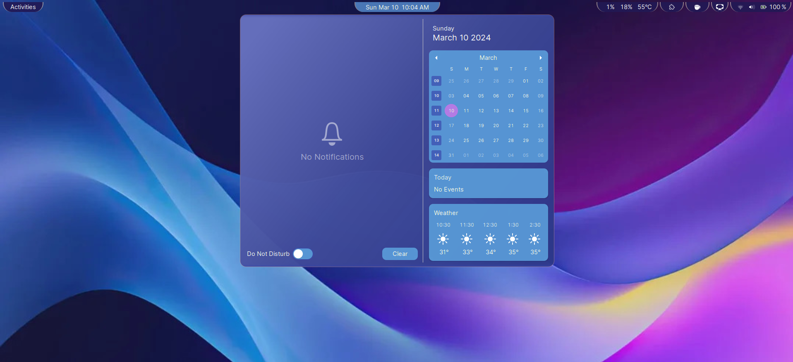
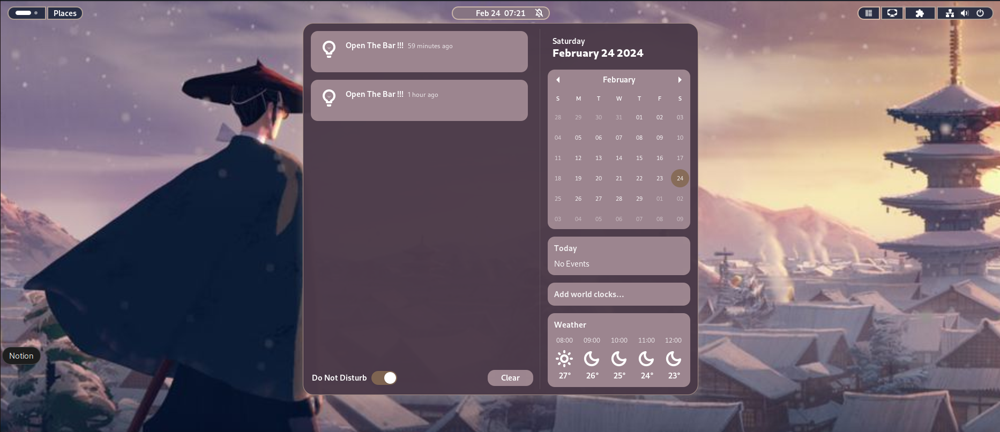
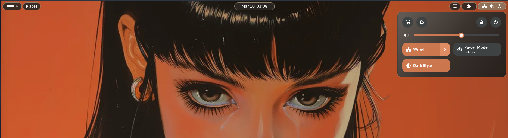
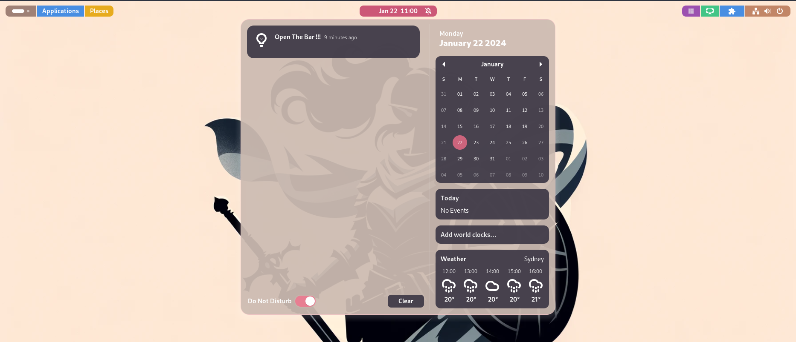
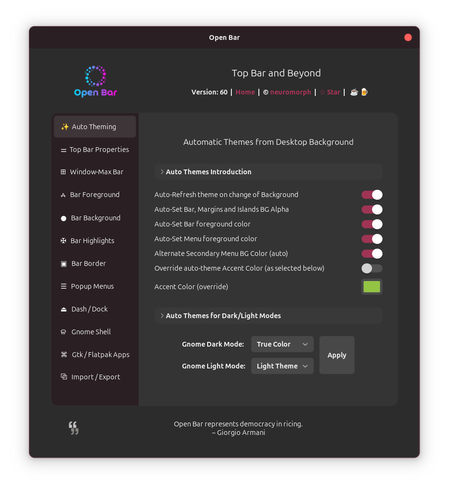

# Open Bar (GNOME 4X Extension)  


A GNOME Shell extension for theming Gnome Top Bar / Top Panel, Menus, Dash/Dock, Gnome Shell and Gtk/Flatpak Apps.  

### Open Bar 2.0: 
- Auto-theming completely renewed. Theme Options: Dark, Light, Pastel, True-Color
- Apply styles to Bar, Menu, Dash / Dock and rest of the shell
- Apply accent color and style Gtk/Flatpak apps
- New UI for preferences/settings  

### Compatibility with Extensions:
- It should be (mostly) compatible with user themes and other extensions that affect the Top Panel 
- Some extensions do not use standard widget and API (e.g. 'PanelMenu.Button' and 'main.addToStatusArea') when adding indicator to Panel and fixing that makes them work correctly with Open Bar (or user themes for that matter).
  

### Auto Theming:
- Note: If you want to save your current settings, please use Export Settings option before applying Auto-theme. You can import it back whenever needed.
- Auto-themes will use the color palette generated from the background image.
- Other settings will be set as selected, by the user, in the preferences tabs.
- Styles will apply to the Top Bar, Menus and optionally to the shell.
        
        - True Color     :  Palette colors as-is (biased towards dark). 
        - Pastel Theme   :  Colors are pastelified (biased towards light).
        - Dark Theme     :  Colors are darkened as needed.
        - Light Theme    :  Colors are lightened as needed.

- You can select themes separately for both Gnome Dark and Light modes. 
- Once theme is applied, you can further tweak any of the manual settings, as usual, to finetune the theme. 
- Color changes made in current mode will be saved for that mode alone. Other settings will apply to both modes.
- There is an option for Auto-refreshing theme when background changes. This will overwrite current themes with newly generated ones when background is changed.
- There are more settings in Auto-Theme. You can select if you want the secondary menu BG color to be derived from BG or auto-selected from palette. You can specify any preferred accent color or let the theme choose from the background. You can also select if foreground color should be auto-generated or use manual selection etc.
- Since it is one size fit all solution, 'No Free Lunch' theorem applies. Not all options will work best for all backgrounds, so the additional knobs above will help you select the desired one. One of the theme combinations should work for you at least with little bit tweaking if needed.
  


### Customize:
- Bar Type: Fixed, Floating or Islands / Trilands
- Bar position, height, margin, paddings
- Bar foreground color, font
- Bar background color, transparency, gradient, shadow, highlights, candybar 
- Shape rectangular to pill, border width, color, neon glow
- Menu customizations: foreground / background colors, transparency, border, shadow,  active/selection, hover colors
etc.
- Includes a custom color palette in each color button popup. The palette is auto-generated from the desktop background.  
- Window-Max Bar: Change Bar props when a window is maximized
- Add accent hint to GTK/Flatpak apps' Headerbar, Sidebar or Card/Dialogs. Add Traffic Light controls, window border, popover styles etc.    
- Import, export theme settings to file.

</br>   

## Installation

### Recommended

[](https://extensions.gnome.org/extension/6580/open-bar/)

It's recommended to install the extension from
[extensions website](https://extensions.gnome.org/extension/6580/open-bar/), or from
the _Extension Manager_ app.


### How to manually install the extension (if needed)?

```
git clone https://github.com/neuromorph/openbar.git \
	~/.local/share/gnome-shell/extensions/openbar@neuromorph
```
OR download the code zip file and unzip at location: ~/.local/share/gnome-shell/extensions/
The extension's directory name should match its uuid i.e. "openbar@neuromorph"

Note: 
Please download from following GitHub branch as per your Gnome version:
- For Gnome 42-44: branch 'g42-44'
- For Gnome 45+: branch 'main'

You will need to restart the Gnome Shell (for manual install):

- Wayland: logout and login again 
- Xorg: `alt+f2` then type `r` and `enter` 

## Settings Notes
If the panel/menu isn't looking right, you need to tweak some settings. There are a lot of knobs to allow for different setups/tastes. It can also make it a bit overwhelming if you are not familiar with css styles but with some experimentation it will become a lot easier. Here are brief notes:
- BG/FG color: Background or Foreground colors. Foreground is typically text and icons.
- Alpha: Transparency for the color. 0 is transparent while 1 is opaque.
- Panel BG will affect the bar while Tri/Islands BG will affect the individual indicator buttons/combos (in Trilands/Islands mode).
- Gradient goes from Start color to End color. If you want a single color fading, select same color for both with different Alphas. e.g. Setting end color alpha to 0 will form a gradient from Start color to transparent.
- Highlight color: It is the background color upon hover or focus. You can choose to highlight with border instead.
- Vertical padding: Controls size of highlights in Mainland/Floating. Also controls size of Islands/Trilands. Increase height if padding squeezes the text.
- Panel Shadow: a downward shadow for the panel bar. Shadow Spread controls both shadow transparency and spread together.
- Border: 
    - Width controls thickness (grows inwards for Islands). Adjust bar height accordingly, after setting border width.  
    - Radius will control the shape from rectangle at radius 0 to Pill at radius close to bar height. 
    - Neon glow: adds a neon-light like glow to the border. You need dark, relatively opaque background with bright/neon colored, relatively opaque border. Neon will override Panel shadow in Mainland and Floating mode.
- Menus: 
    - FG/BG, border, highlight are similar to above but for menus.
    - Selected/active color is for menu items that are active e.g. Today's day in Calendar or WiFi in Quick Settings or even an active menu item with opened submenu. 
    - Shadow applies to the panel menu. Use white/bright color in dark theme and black/dark color in light theme for the effect to show and help with contrast. Using same color as menu border is also a good idea. Use the Alphas for both border and shadow to increase or reduce their effect.
- Lastly, be a tiny bit gentler with the sliders in the settings as they modify the stylesheet behind the scene for every update.


## What's New (recent first)
- Open Bar 2.0: New Auto-theming, Apply Styles to Dash/Dock, Shell and Gtk/Flatpak apps
- Automatic FG color, Panel Box color, Light-gradient for menus and creative tweaks for border width and radius
- Auto-theming options 
- Import, export theme settings to file.
- Window-Max Bar: Change Bar props when a window is maximized
- More settings in Menus: Menu panel and buttons radius, slider tweaks
- Apply style to notification popups
- Candy-bar palette for panel buttons
- Menu secondary color override to allow selecting custom (high contrast) colors within the menu
- Fixes for screencast/ remote sharing/ battery indicators and DND toggle switch etc.
- Rewrite to fully use stylesheet approach. Several enhancements and fixes. New additions: 
    - Desktop background color palette in every color button popup. This makes it very easy to select colors according to current wallpaper.
    - Highlights with border.
    - Horizontal and vertical paddings for buttons.
    - Bar position Top vs Bottom.
    - Compatibility with Arc Menu etc.
- New Bar Type 'Trilands' and compatibility with 'Quick Settings Audio Panel' extension
- New overhauled version with support for menus including Calendar, Notifications, Quick Settings etc.
- Initial version created


## Screenshots

More recent screenshots can be found in the [Reddit post here](https://www.reddit.com/r/unixporn/comments/1ethgn2/ocgnome_open_bar_for_the_rice_guys/).

Auto-Themes Examples:  



 

Candybar Example: 

 

Window-Max Bar Example: 

 

More Examples: 


 

Settings Window:
  

Some More Samples: 

 


